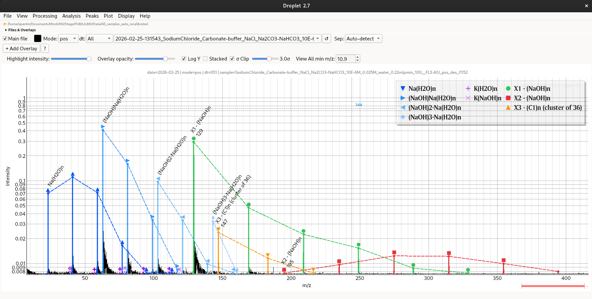

# Droplet

> Interactive desktop viewer and analysis toolkit for LILBID mass spectrometry data.

   

---

## Why Droplet?

Droplet provides a complete desktop workflow for LILBID mass spectrometry analysis in a single application:

- Interactive spectrum exploration
- Fast peak annotation and comparison
- Batch recalibration and processing
- Publication-quality plotting
- Native desktop performance with PyQt6 + pyqtgraph
- One-click installers for Windows, macOS and Linux

---

## Features

### Visualisation

- Linear and log-Y plotting
- Stacked multi-spectrum view, with **Dynamic Scaling** (per-spectrum 0–1 normalisation) or shared raw-intensity Y axis
- Configurable peak-list legend
- Publication-quality figure export

### Analysis

- Peak annotation and label tools
- Peak-list **groups**: collapsible, drag-and-drop reorderable, with per-group highlight opacity and intuitive label modes
- Peak list search (`Ctrl+F`), copy / paste / duplicate / aggregate rows
- Peak list overlap check between peak lists
- Isotopic envelope visualisation
- Cluster detection
- Peak comparison across spectra
- Peak area integration with an interactive **peak boundary checker**
- Two-click **peak intensity ratio** tool (`R`)
- Recalibration residuals viewer

### Processing

- airPLS and SNIP baseline correction
- Automatic and manual recalibration, with a live **recalibration residuals preview** before saving
- Processing parameters (baseline, recalibration fit, ToF → mass) written into output file headers
- Spectrum normalisation
- ToF → mass conversion tool (reference peak based)

### Workflow

- Drag-and-drop loading & Data folder managing
- Overlay management
- Batch processing and batch PNG export (respects mode / dt filters)
- Session/project save files (`.drp`)
- Background update checking
- Built-in updater utility
- Install and launch previous versions side by side (Help → Previous Versions…)

---

## Installation

Droplet runs from its own folder. The installers create a private Python environment (`.venv`) inside that folder, install the dependencies into it, and add a launcher to your system. Nothing is installed system-wide, so Droplet never conflicts with other Python projects, Anaconda, or system packages.

### 1. Requirements

- **Python 3.11 or newer**, already installed on the computer ([python.org](https://www.python.org/downloads/), Anaconda / Miniconda, Homebrew, or your Linux package manager all work)
- An internet connection the first time you install, to download the dependencies

### 2. Get Droplet

Either clone the repository:

```bash
git clone https://github.com/krockdurr/Droplet.git
```

or download the ZIP from GitHub (**Code → Download ZIP**) and extract it.

Put the folder somewhere permanent **before** installing, for example `Documents/Droplet`. The launcher points at this folder, so if you move it later, just run the installer again.

### 3. Run the installer for your system

| System  | Run this file                   | What you get                                                     |
| ------- | ------------------------------- | ---------------------------------------------------------------- |
| Windows | `Install_Droplet_Windows.bat`   | **Droplet** shortcut on the Desktop                              |
| macOS   | `Install_Droplet_macOS.command` | **Droplet.app** in `~/Applications` (Spotlight, Launchpad, Dock) |
| Linux   | `Install_Droplet_Linux.sh`      | **Droplet** entry in the application menu                        |

<details>
<summary><b>Windows</b></summary>

1. Open the Droplet folder and double-click **`Install_Droplet_Windows.bat`**.
2. If Windows SmartScreen says *"Windows protected your PC"*, click **More info → Run anyway**.
3. A console window shows the dependency download; a message box confirms when it is done.
4. Start Droplet from the **Droplet** shortcut on your Desktop.

The installer finds Python on your `PATH`, through the `py` launcher, or in the usual Anaconda / Miniconda / python.org locations. The Microsoft Store placeholder `python.exe` is ignored. If you install Python from python.org, tick **"Add python.exe to PATH"**.

</details>

<details>
<summary><b>macOS</b></summary>

1. Open the Droplet folder and double-click **`Install_Droplet_macOS.command`**. A Terminal window opens and runs the installer.

2. If macOS blocks it (*"cannot be opened because it is from an unidentified developer"*), right-click the file → **Open** → **Open**. You can also run it from Terminal:
   
   ```bash
   cd /path/to/Droplet
   bash Install_Droplet_macOS.command
   ```

3. A dialog confirms when installation is complete.

4. Start Droplet from **Droplet** in `~/Applications`, Spotlight or Launchpad. You can drag it to the Dock.

The installer looks for Python on your `PATH`, in Anaconda / Miniconda, Homebrew (`/opt/homebrew`, `/usr/local`) and the python.org framework build. Apple's `/usr/bin/python3` is only used if the Xcode Command Line Tools are installed.

</details>

<details>
<summary><b>Linux</b></summary>

1. Open a terminal in the Droplet folder and run:
   
   ```bash
   bash Install_Droplet_Linux.sh
   ```
   
   (or `chmod +x Install_Droplet_Linux.sh` once, then double-click it / choose *Run as a program* in your file manager).

2. A notification or dialog confirms when installation is complete.

3. Start Droplet from your application menu (category *Science*).

If the installer reports that `venv` or `pip` is missing, install them first, for example on Debian / Ubuntu:

```bash
sudo apt install python3-venv python3-pip
```

</details>

#### What the installer does

1. Finds a working Python 3 interpreter and checks its version.
2. Creates (or reuses) `.venv` inside the Droplet folder. A broken `.venv`, for example after a Python upgrade, is rebuilt automatically.
3. Makes sure `pip` is available (`ensurepip`, falling back to `get-pip.py`).
4. Installs the pinned dependencies from `assets/assimilation_guides/requirements.txt`. If they can't be installed on your Python version, it retries with `requirements_new.txt`.
5. Creates the launcher (Desktop shortcut / `Droplet.app` / `.desktop` entry) that runs `Droplet.py` with the `.venv` Python.

If something fails (no Python, no network, no permission…), the installer stops and tells you why. Running it again is always safe.

#### Re-running the installer / several copies

The installer detects an existing Droplet launcher:

- **Same folder**: the installation is updated/repaired (dependencies refreshed, launcher rewritten).
- **Another Droplet folder**: it shows both folders and versions and asks whether to switch the launcher to this copy. The other folder is never modified or deleted.
- **Folder no longer exists**: the stale launcher is replaced.

Only one copy at a time has a launcher. Any other copy can still be run manually (see below).

### Manual installation (advanced)

If you prefer to manage the environment yourself:

```bash
cd Droplet
python3 -m venv .venv

# macOS / Linux
source .venv/bin/activate
# Windows
.venv\Scripts\activate

pip install -r assets/assimilation_guides/requirements.txt
# If that fails (e.g. no wheels for your Python version):
# pip install -r assets/assimilation_guides/requirements_new.txt

python Droplet.py
```

<details>
<summary>Pinned dependencies</summary>

| Package    | `requirements.txt` | `requirements_new.txt` |
| ---------- | ------------------ | ---------------------- |
| PyQt6      | 6.11.0             | 6.11.0                 |
| pyqtgraph  | 0.14.0             | 0.14.0                 |
| NumPy      | 2.3.5              | 1.26.4                 |
| SciPy      | 1.16.1             | 1.16.1                 |
| pandas     | 2.3.3              | 2.2.2                  |

</details>

---

## Running

- **Windows**: double-click the **Droplet** shortcut on the Desktop.
- **macOS**: open **Droplet** from `~/Applications`, Spotlight or Launchpad.
- **Linux**: open **Droplet** from the application menu.

From a terminal, inside the Droplet folder:

```bash
# macOS / Linux
.venv/bin/python Droplet.py

# Windows
.venv\Scripts\python Droplet.py
```

### Example data

On first launch Droplet opens `assets/example_spectra/`. It holds five synthetic LILBID spectra with known answers: raw negative- and positive-mode water calibrants for auto-recalibration and baseline correction, a NaCl spectrum for cluster and isotope-envelope detection, a peak area / ratio standard, and a later-delay-time water spectrum for comparisons. Matching peak lists are included. See [its README](assets/example_spectra/README.md) for what each file tests. The polarity filter starts on **neg**; switch to **pos** or **All** to see every file.

---

## Updating

Each time Droplet starts, it checks GitHub in the background and opens the updater window only if a newer version is available. You can also open the updater at any time from **Help → Check for Updates…**, or run it from inside the Droplet folder with Droplet's own Python:

```bash
# macOS / Linux
.venv/bin/python -m droplet_pkg.updater

# Windows
.venv\Scripts\python -m droplet_pkg.updater
```

The updater:

- compares the local version (`assets/about/VERSION`) with the one on the repository's default branch
- opens a window showing what it is about to do (nothing, or update X → Y), with **Update** / **Cancel** buttons; nothing changes until you click Update
- updates via `git pull --ff-only` (cloned folder) or by downloading the ZIP from GitHub
- in ZIP mode, backs up every file it replaces to `droplet_backup_YYYYMMDD_HHMMSS/`

Use `--check` to only report whether an update is available, `--yes` to skip the confirmation, or `--console` to use the terminal instead of a window.

After an update, **run the installer again** so the dependencies and launcher match the new version, then restart Droplet.

### Upgrading from v2.x

Version 3.0 changes the folder layout (`Droplet_v2.7.2.py` → `Droplet.py`, `droplet/` → `droplet_pkg/`, requirements moved to `assets/assimilation_guides/`). The simplest upgrade path is:

1. Download or clone v3.0 into a **new** folder.
2. Run the installer for your system from that folder.
3. Delete the old v2.x folder once you are happy with the new one.

Your settings, saved legend labels and peak-list files are kept: they live outside the Droplet folder, and peak-list `.json` files from v2.x load into v3.0 (their rows are placed in an *Unclassified* group).

### Previous versions

**Help → Previous Versions…** lists the older releases on GitHub. Select one to **Install**, **Launch** (or double-click) or **Remove** it. Each previous version is downloaded into `previous_versions/<version>/` inside the Droplet folder, with its own Python environment (about 600 MB) holding library versions tested with it. The current version is never changed and remains the one the launcher opens.

- Old releases need their own environment: every 2.x release calls `np.trapz`, which NumPy 2.4 removed.

- Settings such as the last opened folder are shared between versions.

- The same is available from a terminal inside the Droplet folder:
  
  ```bash
  .venv/bin/python -m droplet_pkg.version_manager list
  .venv/bin/python -m droplet_pkg.version_manager install v2.7.2
  .venv/bin/python -m droplet_pkg.version_manager launch v2.7.2
  .venv/bin/python -m droplet_pkg.version_manager remove v2.7.2
  ```

---

## Uninstalling

Run the uninstaller for your system from the Droplet folder:

| System  | Run this file                     |
| ------- | --------------------------------- |
| Windows | `Uninstall_Droplet_Windows.bat`   |
| macOS   | `Uninstall_Droplet_macOS.command` |
| Linux   | `bash Uninstall_Droplet_Linux.sh` |

The uninstaller:

1. Removes the launcher (Desktop shortcut / `~/Applications/Droplet.app` / application-menu entry). On macOS it asks for confirmation first.

2. Lists Droplet's settings and user data, if any, and asks whether to remove them too (the default is **Keep**):
   
   | Data                          | Windows                                    | macOS                                               | Linux                              |
   | ----------------------------- | ------------------------------------------ | --------------------------------------------------- | ---------------------------------- |
   | Settings (QSettings)          | Registry `HKCU\Software\LILBID\PeakViewer` | `~/Library/Preferences/com.lilbid.PeakViewer.plist` | `~/.config/LILBID/PeakViewer.conf` |
   | Saved legend entries / labels | `%USERPROFILE%\.droplet`                   | `~/.droplet`                                        | `~/.droplet`                       |
   | Updater backups               | `droplet_backup_*` in the Droplet folder   | same                                                | same                               |

3. Leaves the Droplet folder itself, including `.venv`, untouched. To remove Droplet completely, delete the Droplet folder afterwards.

Close Droplet before uninstalling. If you pinned Droplet to the macOS Dock or Windows taskbar, unpin it manually.

---

## Typical Workflow

1. Load spectra
2. Apply baseline correction
3. Detect and annotate peaks (organise peak lists into groups)
4. Recalibrate masses, checking the residuals preview before saving
5. Compare spectra, measure areas / ratios, or detect clusters
6. Export publication-ready figures

---

## Latest Update (v3.0)

Highlights:

- **One-click installers and uninstallers** for Windows, macOS and Linux, each with its own isolated `.venv`
- New layout: `Droplet.py` launcher, `droplet_pkg/` package, pinned requirements in `assets/assimilation_guides/`
- **Peak-list groups** with drag-and-drop, per-group opacity and L / 1L / envelope toggles; groups saved in peak-list files
- Peaks window: search (`Ctrl+F`), multi-row selection, copy / paste / duplicate / aggregate, insert above / below, *Show edited only*, peak list overlap check
- **Peak boundary checker**: inspect and drag-edit integration bounds before exporting peak areas (single file and batch)
- **Peak ratio tool** (`R`): click two peak apices to get their intensity ratio
- **Residuals preview** before saving a manual recalibration, with live updates and click-to-jump to peak rows
- Recalibration, baseline and ToF → mass parameters recorded in output file headers
- Stacked mode: **Dyn Scale** toggle, fast in-place updates without rebuilding, *Return to last zoom*
- NumPy 2 compatibility, more robust peak-boundary detection, and a shutdown crash fix

See [RELEASE_NOTES.md](assets/about/RELEASE_NOTES.md) for full details.

---

## Screenshots

### Main Viewer

<p align="center">
 
</p>

### Stacked Mode

<p align="center">
 
</p>

---

## Keyboard Shortcuts

<details>
<summary>Show shortcuts</summary>

| Key                                     | Action                            |
| --------------------------------------- | --------------------------------- |
| `Z`                                     | Toggle zoom-box mode              |
| `P`                                     | Toggle click-to-pick peak mode    |
| `A`                                     | Toggle peak area measurement mode |
| `R`                                     | Open the Peak Ratio tool          |
| `F5`                                    | Reload current file               |
| `Ctrl+S` / `Ctrl+Shift+S`               | Save project / Save project as    |
| `Ctrl+Shift+O`                          | Open project                      |
| `Ctrl+P`                                | Open Peaks window                 |
| `Ctrl+F` (Peaks window)                 | Search peak lists                 |
| `Ctrl+Shift+P`                          | Print                             |
| `Ctrl+Z` / `Ctrl+Y` (or `Ctrl+Shift+Z`) | Undo / redo peak edits            |
| `Ctrl+Scroll`                           | Cycle through overlays            |
| `Ctrl+↑` / `Ctrl+↓`                     | Cycle overlays up / down          |
| `Ctrl+Shift+C`                          | Copy plot to clipboard            |
| `Ctrl+Q`                                | Quit                              |

Peak boundary checker: `Ctrl+Z` / `Ctrl+Y` undo / redo, `Ctrl+R` reset all bounds, `Enter` confirm, `Esc` cancel.

</details>

---

## File Format

<details>
<summary>Supported spectrum formats</summary>

Droplet reads two-column text files:

```text
m/z    intensity
```

Supported separators:

- Tab
- Comma
- Semicolon
- Space

Features:

- Automatic separator detection
- Comment lines beginning with `#` (original headers are preserved in processed files)
- Optional manual separator override

Filename parsing supports:

- polarity detection (`neg` / `pos`)
- dt filtering (`_dt071`, etc.)
- sample name and plot title (sample = tokens between the date and the flow-rate token, e.g. `0.22mlpmin`)

Example:

```text
20240101_sample_neg_dt071.txt
```

Processed files carry `#key=value` metadata headers describing what was done, e.g. `#processed=…`, `#baseline_method=airPLS`, `#recalibration_method=manual`, `#recal_fitparam_a0=…`, `#recal_pair_1=…`, `#tof2mass_a=…`.

</details>

---

## Project Structure

<details>
<summary>Source tree</summary>

```text
Droplet.py                          # launcher (run this)
README.md
Install_Droplet_Windows.bat         # installers
Install_Droplet_macOS.command
Install_Droplet_Linux.sh
Uninstall_Droplet_Windows.bat       # uninstallers
Uninstall_Droplet_macOS.command
Uninstall_Droplet_Linux.sh

droplet_pkg/                        # the application
├── __init__.py                     # APP_VERSION, read from assets/about/VERSION
├── app.py                          # main window, menus, plotting, render loop, glue code;
│                                   #   also ManualRecalWindow, PeakReviewWindow,
│                                   #   SavedLabelsImportDialog
├── constants.py                    # colours, symbols, limits (no dependencies)
├── updater.py                      # updater: python -m droplet_pkg.updater
├── version_manager.py              # previous versions: python -m droplet_pkg.version_manager
├── io/
│   ├── spectrum_reader.py          # read / write spectrum files, separators, # headers
│   └── file_utils.py               # folder scanning, polarity / dt filters, virtual folders
├── processing/
│   ├── baseline.py                 # airPLS, SNIP, Whittaker smoother
│   ├── calibration.py              # auto-recalibration (calibrant tables) and manual recal pairs
│   ├── normalization.py            # normalisation and noise-floor estimate
│   └── signal.py                   # subtraction, peak bounds, tolerance / shift formulas
├── analysis/
│   ├── peaks.py                    # peak detection (% / SNR) and highlight geometry
│   └── clusters.py                 # regularly spaced series (cluster) detection
└── ui/
    ├── widgets.py                  # reusable widgets (collapsible section, peak rows, …)
    ├── mixins.py                   # "Pin on top" for popup windows
    ├── update_checker.py           # starts the updater (startup check, Help menu)
    └── windows/
        ├── cluster_detection.py    # Analysis → Cluster Detection
        ├── peak_area.py            # peak areas, ratios and the peak boundary checker
        ├── peak_comparison.py      # common / unique peaks across spectra
        ├── peak_confirmation.py    # peak-list confirmation side panel
        ├── residuals_viewer.py     # recalibration residuals (Δm/z) browser
        ├── tutorial.py             # first-launch tutorial overlay
        ├── previous_versions.py    # Help → Previous Versions
        ├── manual_recal.py         # shims for ManualRecalWindow and
        └── peak_review.py          #   PeakReviewWindow; the classes live in app.py

assets/
├── about/                          # VERSION, LICENSE, RELEASE_NOTES.md
├── icons/                          # Droplet_Icon .ico / .icns / .png
├── assimilation_guides/            # requirements.txt, requirements_new.txt,
│                                   # Droplet.desktop template,
│                                   # Windows_install.ps1, Windows_uninstall.ps1
├── docs/images/                    # README screenshots
├── example_spectra/                # 5 example spectra, peak lists, expected_values.json,
│                                   # README.md (opened on first launch)
└── test/
    ├── test_suite.py               # python assets/test/test_suite.py [--console]
    └── generate_example_spectra.py # regenerates example_spectra/
```

`.venv/` is created by the installer, `droplet_backup_*/` by the updater and `previous_versions/` by Help → Previous Versions; none of them is part of the repository. Delete `previous_versions/` to remove every installed previous version at once.

</details>

---

## Documentation

- [RELEASE_NOTES.md](assets/about/RELEASE_NOTES.md)
- [LICENSE](assets/about/LICENSE)

---

## Algorithms and Credits

- Baseline correction (airPLS) and auto-recalibration algorithms adapted from:
  - https://github.com/mumair5393/LILBID_GUI

Built with:

- Python
- PyQt6
- pyqtgraph
- NumPy
- SciPy
- pandas

---

## License

Released under the MIT License.

See [LICENSE](assets/about/LICENSE) for details.

---

## Attribution Request

If you use this software in academic work, commercial products, or public projects,  
the author kindly requests attribution or citation where reasonable.

Suggested citation:

```textile
Quentin Betton — Droplet (2026)
https://github.com/krockdurr/Droplet
```

This request is not a condition of the MIT License.
