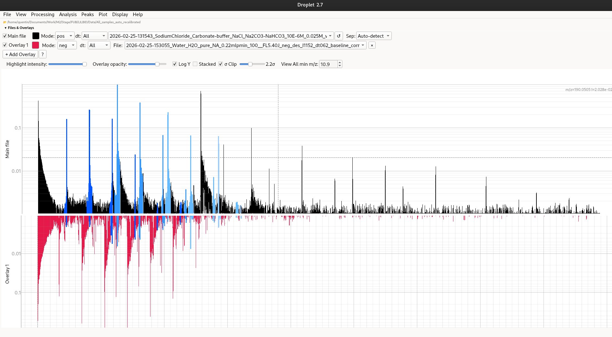
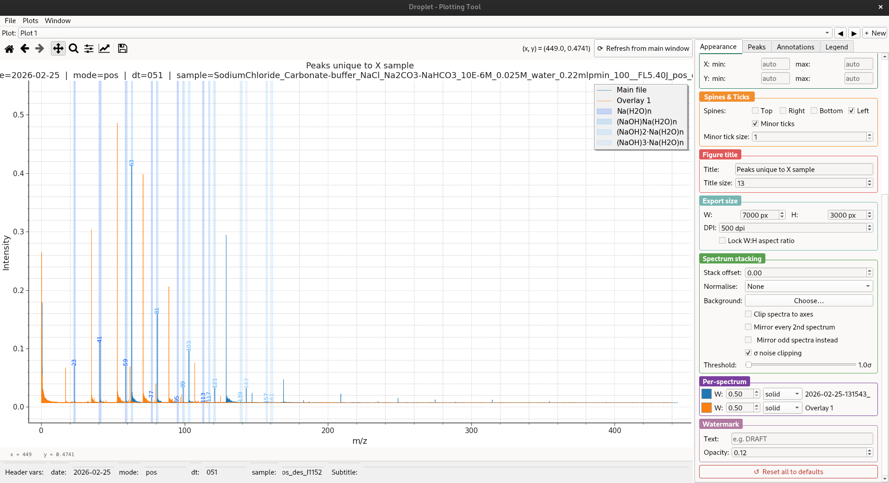

# Droplet

> Interactive desktop viewer and analysis toolkit for LILBID mass spectrometry data.


---

## Why Droplet?

Droplet provides a complete desktop workflow for LILBID mass spectrometry analysis in a single application:

- Interactive spectrum exploration
- Fast peak annotation and comparison
- Batch recalibration and processing
- Publication-quality plotting
- Native desktop performance with PyQt6 + pyqtgraph

---

## Features

### Visualisation

- Linear and log-Y plotting
- Dark and bright themes
- Stacked multi-spectrum view
- Minimap overview overlay
- Zoom history navigation
- Publication-quality figure export

### Analysis

- Peak annotation and label tools
- Isotopic envelope visualisation
- Cluster detection
- Peak comparison across spectra
- Peak area integration
- Residuals viewer

### Processing

- airPLS and SNIP baseline correction
- Automatic and manual recalibration
- Spectrum normalisation
- ToF → mass conversion

### Workflow

- Drag-and-drop loading
- Overlay management
- Batch processing
- Session/project save files (`.drp`)
- Background update checking
- Built-in updater utility

---

## Quick Start

```bash
git clone https://github.com/krockdurr/Droplet.git
cd Droplet

python -m venv .venv

# macOS / Linux
source .venv/bin/activate

# Windows
.venv\Scripts\activate

pip install -r requirements.txt

python Droplet_v2.7.1.py
```

---

## Installation

### Requirements

- Python ≥ 3.10
- PyQt6 ≥ 6.4
- pyqtgraph ≥ 0.13
- NumPy ≥ 1.24
- SciPy ≥ 1.10
- pandas ≥ 2.0
- matplotlib ≥ 3.7

### Install from source

```bash
git clone https://github.com/krockdurr/Droplet.git
cd Droplet
pip install -r requirements.txt
```

---

## Running

```bash
python Droplet_v2.7.1.py
```

On Windows, `Droplet_v2.7.1.py` can also be launched directly by double-clicking if Python is associated with `.py` files.

---

## Updating

```bash
python updater.py
```

The updater:

- checks the latest GitHub version
- creates a backup
- updates via `git pull` or ZIP download
- optionally restarts Droplet

---

## Typical Workflow

1. Load spectra
2. Apply baseline correction
3. Detect and annotate peaks
4. Recalibrate masses
5. Compare spectra or detect clusters
6. Export publication-ready figures

---

## Latest Update (v2.7.1)

Highlights:

- Stacked mode rendering: eliminated flickering and mid-update frozen states when changing labels, zoom, or envelopes
- Stacked mode symbols: proper vertical stacking for multiple peaks at the same m/z (same row or different rows), matching normal mode behaviour
- Label position, font size, and angle controls now update stacked mode instantly without a full rebuild
- Legend window no longer auto-on-top or raised when the main window is focused; closes when the main application closes
- Peak area CSV exports: `.csv` extension added automatically, `3_sigma_clip_noise_floor` value written in file header

See [RELEASE_NOTES.md](RELEASE_NOTES.md) for full details.

---

## Screenshots

### Main Viewer

<p align="center">
  
</p>

### Stacked Mode

<p align="center">
  
</p>

## Plotting Tool

<p align="center">
  
</p>

---

## Keyboard Shortcuts

<details>
<summary>Show shortcuts</summary>

| Key                 | Action                            |
| ------------------- | --------------------------------- |
| `Z`                 | Toggle zoom-box mode              |
| `P`                 | Toggle click-to-pick peak mode    |
| `A`                 | Toggle peak area measurement mode |
| `F5`                | Reload current file               |
| `Ctrl+P`            | Open Peaks window                 |
| `Ctrl+Shift+P`      | Print                             |
| `Ctrl+Z` / `Ctrl+Y` | Undo / redo peak edits            |
| `Ctrl+Scroll`       | Cycle through overlays            |
| `Ctrl+↑` / `Ctrl+↓` | Cycle overlays up / down          |
| `Ctrl+Shift+T`      | Open Plotting Tool                |
| `Ctrl+Shift+C`      | Copy plot to clipboard            |
| `Ctrl+Q`            | Quit                              |

</details>

---

## File Format

<details>
<summary>Supported spectrum formats</summary>

Droplet reads two-column text files:

```text
m/z    intensity
```

Supported separators:

- Tab
- Comma
- Semicolon
- Space

Features:

- Automatic separator detection
- Comment lines beginning with `#`
- Optional manual separator override

Filename parsing supports:

- polarity detection (`neg` / `pos`)
- dt filtering (`_dt071`, etc.)

Example:

```text
20240101_sample_neg_dt071.txt
```

</details>

---

## Project Structure

<details>
<summary>Source tree</summary>

```text
Droplet_v2.7.1.py
VERSION
updater.py
test_suite.py

droplet/
├── app.py
├── constants.py
├── io/
├── processing/
├── analysis/
└── ui/
```

</details>

---

## Documentation

- [RELEASE_NOTES.md](RELEASE_NOTES.md)
- [LICENSE](LICENSE)

---

## Algorithms and Credits

- Baseline correction (airPLS) and auto-recalibration algorithms adapted from:
  - https://github.com/mumair5393/LILBID_GUI

Built with:

- Python
- PyQt6
- pyqtgraph
- NumPy
- SciPy
- pandas
- matplotlib

---

## License

Released under the MIT License.

See [LICENSE](LICENSE) for details.

---

## Attribution Request

If you use this software in academic work, commercial products, or public projects,  
the author kindly requests attribution or citation where reasonable.  

Suggested citation:

```textile
Quentin Betton — Droplet (2026)
https://github.com/krockdurr/Droplet
```

This request is not a condition of the MIT License.
